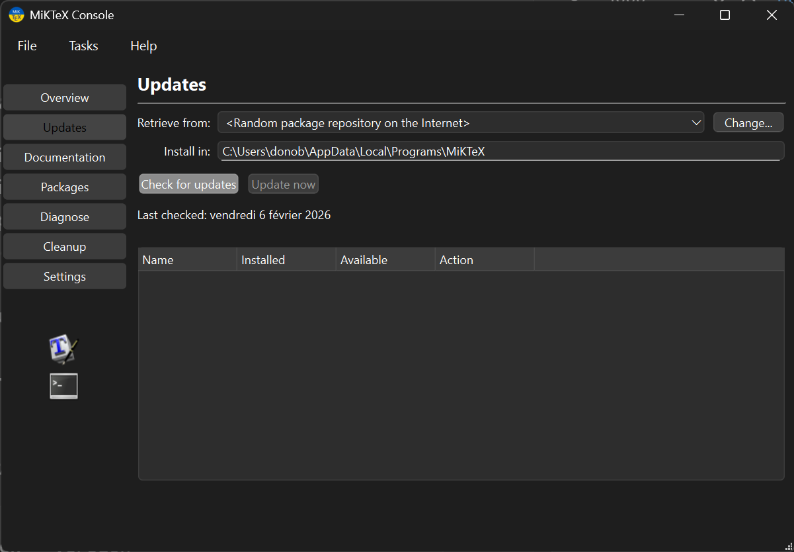
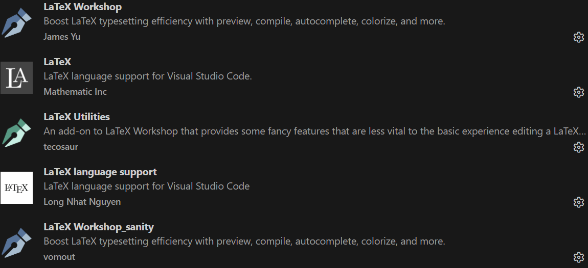

# Guía de Instalación
## Windows (Español)

> **Para**: José Miguel (y cualquier persona con Windows en español)

> **Tiempo estimado**: 45-60 minutos  
> **Tu rol**: Colaborador

---

## Resumen de Verificación

| Herramienta | Requerida | Verificación |
|-------------|-----------|--------------|
| Cuenta de GitHub | ✅ | Iniciar sesión en github.com |
| Git | ✅ | `git --version` |
| Visual Studio Code | ✅ | Se abre desde el Menú Inicio |
| MiKTeX | ✅ | `pdflatex --version` |
| Strawberry Perl | ✅ | `perl --version` |
| Extensión LaTeX Workshop | ✅ | Aparece ícono en VS Code (aunque no necesariamente)|

> **💡 ¿Ya tienes GitHub, Git y VS Code?** Verifica rápidamente abriendo **PowerShell** y ejecutando:
> ```
> git --version
> code --version
> ```
> Si ambos comandos muestran una versión y puedes iniciar sesión en [github.com](https://github.com), ¡continúa directamente con el **[Paso 4: MiKTeX](#paso-4-miktex-15-20-min)**!

---

## Paso 1: Cuenta de GitHub (2 min)

1. Ir a [github.com](https://github.com)
2. Clic en **"Sign up"** (esquina superior derecha)
3. Seguir el proceso de registro
4. **Importante**: Recuerda tu correo — lo necesitarás para configurar Git

> 📖 Fuente oficial: [GitHub Docs - Creating an account](https://docs.github.com/en/get-started/signing-up-for-github/signing-up-for-a-new-github-account)

---

## Paso 2: Git (10 min)

### Descargar e Instalar

1. Ir a [git-scm.com/download/win](https://git-scm.com/download/win)
2. La descarga comenzará automáticamente
3. Ejecutar el instalador (`Git-2.x.x-64-bit.exe`)

### Opciones de Instalación (¡Importante!)

Durante la instalación verás varias pantallas. Aquí están las opciones clave:

| Pantalla | Opción a Seleccionar |
|----------|---------------------|
| **Select Components** | Dejar valores por defecto |
| **Choosing the default editor** | Seleccionar "Use Visual Studio Code as Git's default editor" *(lo instalaremos en el Paso 3, pero la opción queda guardada)* |
| **Adjusting your PATH** | ⚠️ Seleccionar **"Git from the command line and also from 3rd-party software"** |
| **Choosing SSH executable** | "Use bundled OpenSSH" |
| **Choosing HTTPS transport backend** | "Use the OpenSSL library" |
| **Configuring line ending conversions** | "Checkout Windows-style, commit Unix-style line endings" |
| **Configuring terminal emulator** | "Use MinTTY" |
| **Default behavior of git pull** | "Default (fast-forward or merge)" |
| **Choose a credential helper** | "Git Credential Manager" |
| **Extra options** | Dejar valores por defecto |

4. Clic en **Install** y esperar a que termine

### Verificar Instalación

Abrir **Windows PowerShell** (buscar "PowerShell" en el Menú Inicio):

```
git --version
```

Resultado esperado: `git version 2.43.0.windows.1` (o similar)

### Configurar Git (¡Esencial!)

Ejecutar estos comandos en PowerShell (reemplaza con tu información):

```bash
git config --global user.name "José Miguel"
git config --global user.email "tu.correo@ejemplo.com"
```

⚠️ **¡Usa el mismo correo que tu cuenta de GitHub!**

Verificar la configuración:
```bash
git config --list
```

> 📖 Fuente oficial: [Git Book - Installing Git](https://git-scm.com/book/en/v2/Getting-Started-Installing-Git)

---

## Paso 3: Visual Studio Code (5 min)

### Descargar e Instalar

1. Ir a [code.visualstudio.com](https://code.visualstudio.com/)
2. Clic en **"Descargar para Windows"** (o "Download for Windows")
3. Ejecutar el instalador (`VSCodeUserSetup-x64-1.x.x.exe`)

### Opciones de Instalación

| Pantalla | Opción a Seleccionar |
|----------|---------------------|
| **Acuerdo de Licencia** | Aceptar |
| **Seleccionar carpeta de destino** | Dejar por defecto |
| **Seleccionar carpeta del Menú Inicio** | Dejar por defecto |
| **Seleccionar tareas adicionales** | ✅ Marcar **"Agregar a PATH"** (Add to PATH) |
| | ✅ Marcar "Agregar acción 'Abrir con Code' al menú contextual de archivo" |
| | ✅ Marcar "Agregar acción 'Abrir con Code' al menú contextual de directorio" |

4. Clic en **Instalar**

### Verificar Instalación

**Opción A - Desde el Menú Inicio (gráfico):**
- Clic en Menú Inicio → Escribir "Visual Studio Code" → Clic en el ícono

**Opción B - Desde la terminal:**
- Abrir PowerShell y escribir:
```
code --version
```

> 📖 Fuente oficial: [VS Code Docs - Setup](https://code.visualstudio.com/docs/setup/setup-overview)

---

## Paso 4: MiKTeX (15-20 min)

### Descargar e Instalar

1. Ir a [miktex.org/download](https://miktex.org/download)
2. Clic en el botón **"Download"** para Windows
3. Ejecutar el instalador (`basic-miktex-x.x.x-x64.exe`)

### Opciones de Instalación

| Pantalla | Opción a Seleccionar |
|----------|---------------------|
| **Condiciones de copia** (Copying conditions) | Aceptar |
| **Ámbito de instalación** (Installation scope) | ⚠️ Seleccionar **"Install MiKTeX only for me"** (Instalar solo para mí) |
| **Carpeta de instalación** | Dejar por defecto |
| **Configuración** (Settings) | ⚠️ Seleccionar **"Yes"** para "Install missing packages on-the-fly" |

4. Clic en **Start** y esperar la instalación

### Actualización Post-Instalación (¡Importante!)

1. Abrir **Menú Inicio** → Buscar **"MiKTeX Console"** → Abrirlo
2. **Puede o no aparecer** un mensaje sobre actualizaciones:
   - Si aparece, dale clic en **"Sí"** (o "Check"), y luego **instala** las actualizaciones que ofrezca
   - Si no aparece, no te preocupes — continúa con el siguiente punto
3. **De todas formas** (haya aparecido el mensaje o no), en el panel izquierdo haz clic en **"Updates"**
4. Clic en **"Check for updates"**
5. Si aparecen paquetes listados debajo, clic en **"Update now"** para instalar todas las actualizaciones



### Verificar Instalación

**⚠️ Cerrar y volver a abrir PowerShell** (para que reconozca el nuevo PATH), luego ejecutar:
```
pdflatex --version
```

Resultado esperado: `MiKTeX-pdfTeX 4.x (MiKTeX 23.x)` (o similar)

> 📖 Fuente oficial: [MiKTeX Manual - Installation](https://miktex.org/howto/install-miktex)

---

## Paso 5: Strawberry Perl (5 min)

### ¿Por qué se necesita?

MiKTeX no incluye Perl, pero `latexmk` (usado por LaTeX Workshop en VS Code) lo requiere.

> 📖 De LaTeX Workshop Wiki: *"MiKTeX is another lightweight distribution with a convenient automatic on-demand package install. Note, however, that for MiKTeX to work correctly with LaTeX Workshop, you need to install Perl."*

### Descargar e Instalar

1. Ir a [strawberryperl.com](https://strawberryperl.com/)
2. Clic en el enlace de descarga de la **"recommended version"** (64-bit)
3. Ejecutar el instalador (`strawberry-perl-5.x.x.x-64bit.msi`)
4. Seguir las opciones por defecto → Clic en **Install**

### Verificar Instalación

**⚠️ Cerrar y volver a abrir PowerShell**, luego ejecutar:
```
perl --version
```

Resultado esperado: `This is perl 5, version 38...` (o similar)

> 📖 Fuente oficial: [Strawberry Perl - About](https://strawberryperl.com/)

---

## Paso 6: Extensión LaTeX Workshop (2 min)

1. Abrir **Visual Studio Code**
2. Clic en el **ícono de Extensiones** en la barra lateral izquierda (el ícono de 3 cuadrados, o presionar `Ctrl+Shift+X`)
3. En la caja de búsqueda, escribir: **"LaTeX Workshop"**
4. Buscar la extensión de **James Yu** (debería ser el primer resultado)
5. Clic en **Install** (Instalar)

### Verificar Instalación

Vamos a crear un archivo LaTeX sencillo para comprobar que todo funciona.

#### 1. Crear la carpeta del taller

1. Abre el **Explorador de archivos** (el ícono de carpeta en la barra de tareas, o presiona `Win + E`)
2. Navega a tu carpeta de **Documentos**, o a la ubicación donde quieras guardar este curso
3. Haz clic derecho en un espacio vacío → **Nuevo** → **Carpeta**
4. Nombra la carpeta **`curso_latex_github`**

> 💡 Esta carpeta será tu espacio de trabajo durante todo el taller.

#### 2. Abrir la carpeta en VS Code

1. Abre **Visual Studio Code**
2. Ve al menú **Archivo** (File) → **Abrir carpeta...** (Open Folder...)
3. Busca y selecciona la carpeta **`curso_latex_github`** que acabas de crear
4. Clic en **Seleccionar carpeta** (Select Folder)
   - Si VS Code pregunta si confías en los autores de la carpeta, haz clic en **"Sí, confío"** ("Yes, I trust the authors")

#### 3. Crear un archivo de prueba

1. En la **barra lateral izquierda** de VS Code verás el nombre de tu carpeta (`CURSO_LATEX_GITHUB`)
2. Pasa el mouse sobre el nombre de la carpeta — aparecerán unos íconos pequeños
3. Haz clic en el **ícono de archivo con un "+"** (Nuevo archivo / New File)
4. Escribe el nombre **`test.tex`** y presiona Enter
   - ⚠️ Asegúrate de que el nombre termine en `.tex`

#### 4. Escribir y compilar

1. Se abrirá el archivo `test.tex` en el editor. Copia y pega el siguiente contenido:

```latex
\documentclass{article}
\begin{document}
Hola, \LaTeX!

Este es un documento de prueba para el taller.
\end{document}
```

2. Presiona `Ctrl+S` para guardar
3. **Compilar**: Presiona `Ctrl+Alt+B` (o también se compila **automáticamente** al guardar)
4. **Ver el PDF**: Presiona `Ctrl+Alt+V` o clic en el **ícono de lupa** en la esquina superior derecha

### Resultado Esperado

Debería aparecer un PDF con:
```
Hola, LATEX!
Este es un documento de prueba para el taller.
```

Si ves esto, **¡todo está listo!** 🎉

> **Si el documento no compila** después de 1-3 minutos:
> 1. Verifica que la extensión **LaTeX Workshop** de James Yu esté instalada en VS Code
> 2. Verifica que **MiKTeX Console** no tenga actualizaciones pendientes
> 3. Reinicia VS Code y vuelve a intentar
> 4. Instala las extensiones adicionales que aparecen en la siguiente captura desde el panel de Extensiones (el ícono de 3 cuadrados en la barra lateral izquierda, o `Ctrl+Shift+X`). Luego intenta compilar de nuevo con `Ctrl+Alt+B` y ver el PDF con `Ctrl+Alt+V`:
>
> 
>
> Después de seguir estos pasos, **¡todo está listo!** 🎉

> 📖 Fuente oficial: [LaTeX Workshop - Marketplace](https://marketplace.visualstudio.com/items?itemName=James-Yu.latex-workshop)

---

## Referencias Oficiales Consultadas

| Recurso | URL |
|---------|-----|
| Git Download | [git-scm.com/download/win](https://git-scm.com/download/win) |
| Git Installation Guide | [git-scm.com/book/en/v2/Getting-Started-Installing-Git](https://git-scm.com/book/en/v2/Getting-Started-Installing-Git) |
| VS Code Setup | [code.visualstudio.com/docs/setup/setup-overview](https://code.visualstudio.com/docs/setup/setup-overview) |
| MiKTeX Installation | [miktex.org/howto/install-miktex](https://miktex.org/howto/install-miktex) |
| Strawberry Perl | [strawberryperl.com](https://strawberryperl.com/) |
| LaTeX Workshop | [marketplace.visualstudio.com/items?itemName=James-Yu.latex-workshop](https://marketplace.visualstudio.com/items?itemName=James-Yu.latex-workshop) |
